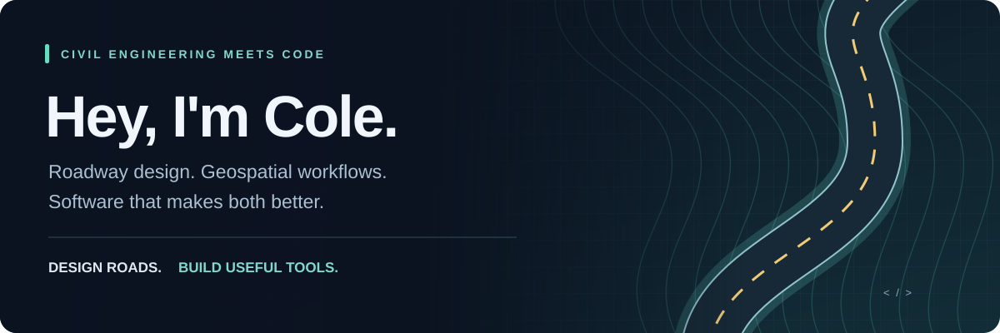

<p align="center">
  
</p>

<p align="center">
  <strong>Civil Engineer · Transportation Design · GIS · Automation</strong>
</p>

<p align="center">
  <a href="https://github.com/colewinstead/VeriCivil">Featured project</a> ·
  <a href="#-the-toolbox">My toolbox</a> ·
  <a href="https://github.com/colewinstead?tab=repositories">Explore my repositories</a>
</p>

I'm Cole, a civil engineer focused on **roadway and transportation design**. I build software that makes engineering workflows faster, clearer, and less repetitive—from roadway calculators and GIS utilities to automations around the house.

**The common thread? Take a real problem. Understand the details. Build something useful.**

## 🛣️ Where engineering meets code

| On the roadway | Behind the workflow | After hours |
| :--- | :--- | :--- |
| Horizontal & vertical geometry | Python engineering utilities | Home Assistant |
| Corridors & superelevation | GIS & terrain processing | Zigbee & smart lighting |
| Interchanges, ramps & roundabouts | Data processing & APIs | Presence & garage automations |
| Plan production & transportation planning | Connecting engineering software | Self hosting & open source |

## 🚧 Featured build · VeriCivil

### Roadway superelevation, from inputs to deliverables.

My **Super Elevation Calculator**, now housed in [VeriCivil](https://github.com/colewinstead/VeriCivil), brings roadway calculations and design exports into one practical workflow.

| Calculate | Review | Export |
| :--- | :--- | :--- |
| Roadway superelevation | Lane slopes & transition stations | Engineering PDF reports |
| Transition geometry | LandXML alignment data | CAD-ready DXF |
| Normal crown to full super | Calculation results | OpenRoads-compatible CSV |

<p>
  <a href="https://github.com/colewinstead/VeriCivil"></a>
  <a href="https://github.com/colewinstead/VeriCivil/releases"></a>
</p>

## 🔧 The toolbox

**Design & geospatial**


**Code & automation**


## 🗺️ From terrain to design

I enjoy the work between raw geospatial data and a useful engineering base map: DEM processing, coordinate systems, State Plane projections, aerial imagery, terrain models, raster reprojection, and contours.

```text
  LiDAR / DEM terrain
          │
          ▼
     QGIS + GDAL
          │
          ▼
  Coordinate transformation
          │
          ▼
  Terrain & engineering base mapping
          │
          ▼
  OpenRoads / Civil 3D
```

## 🏠 Automation doesn't stop at the office

Away from roadway design, I'm usually tinkering with **Home Assistant**: Zigbee devices, smart lighting, garage automations, presence detection, notifications, remote access, and custom automations that make everyday routines easier.

## 🚀 What I'm building toward

Tools that reduce manual calculations, connect engineering software, process roadway and GIS data, and turn useful engineering ideas into working applications.

<p align="center">
  <a href="https://github.com/colewinstead?tab=repositories">Browse my projects</a> ·
  <a href="https://github.com/colewinstead?tab=overview">See my GitHub activity</a>
</p>

---

<p align="center"><strong>Design roads. Automate the boring stuff. Build useful tools.</strong></p>
